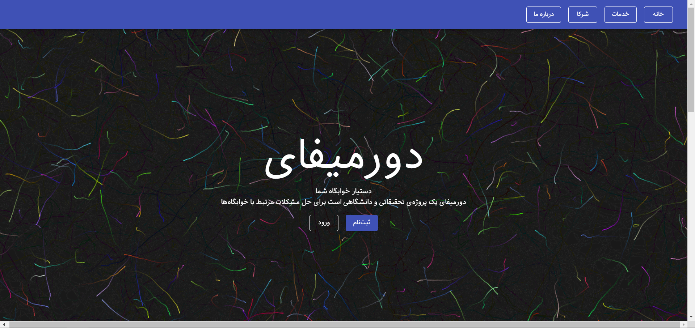

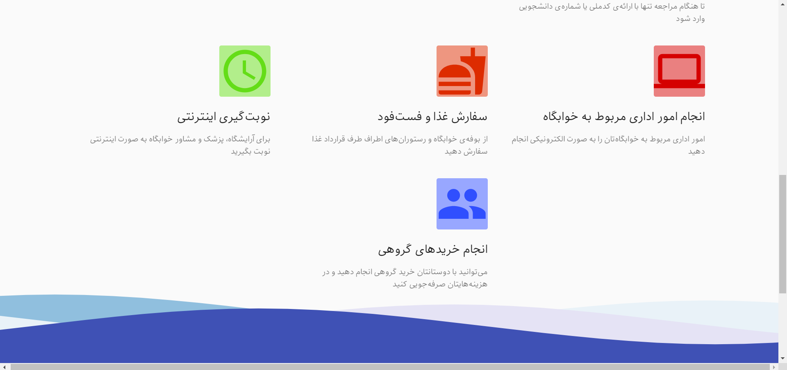

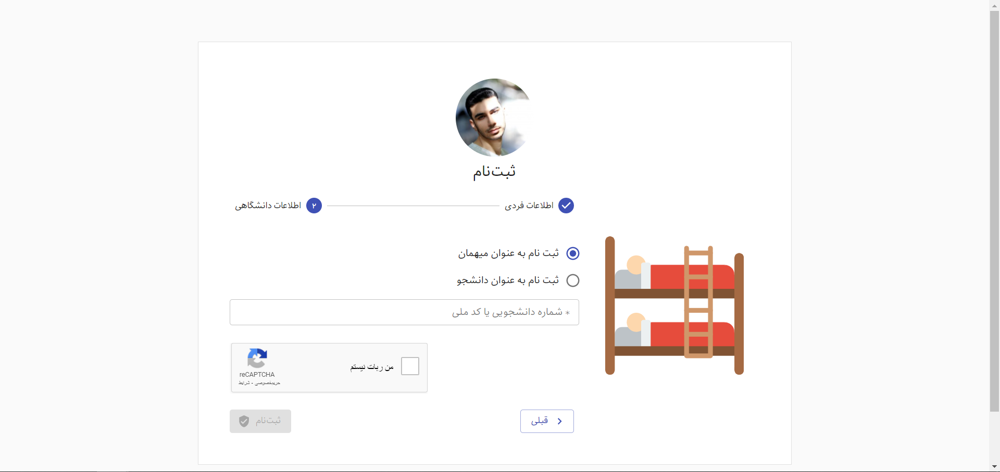

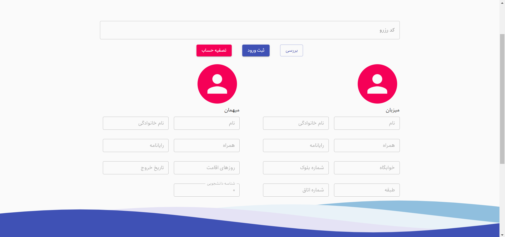

- Carrying out team coordination and work
- Meeting with dormitory managers for requirements engineering and data gathering.
- We hold scrum meeting (planning, daily ...) in Microsoft Teams during COVID19 pandemic
- We designed and developed a software for managing dormitory stuffs like ticketing, issue tracking, guest invitation
- We designed fully dockerized and automated CI/CD during development of software

#### Description of CI/CD

our project contains two packages. One package called common that contains reusable components
and utilities and main package called student-panel.
I designed a pipeline that contains of 3 stage:

- build
- type-coverage (using [type-coverage package](https://github.com/plantain-00/type-coverage))
- test (unit testing with Jest and e2e testing with Cypress)

After each build we collect artifacts containing build output, test result and coverage,
Cypress videos and screenshots and type-coverage results.

#### Some screenshots form CI/CD:

#### Pipelines

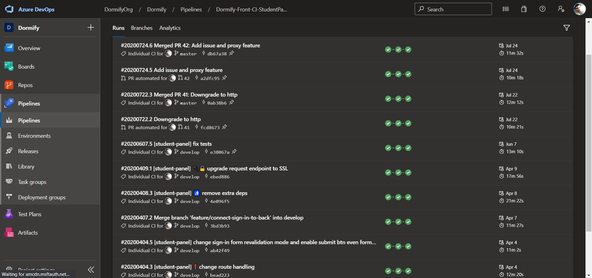

#### Pipeline result

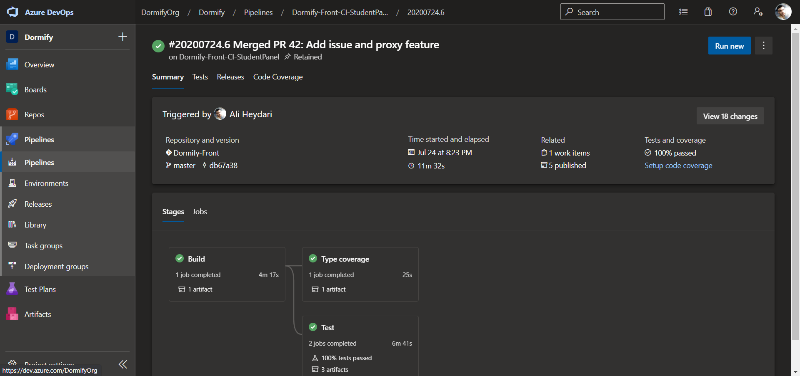

#### Test results

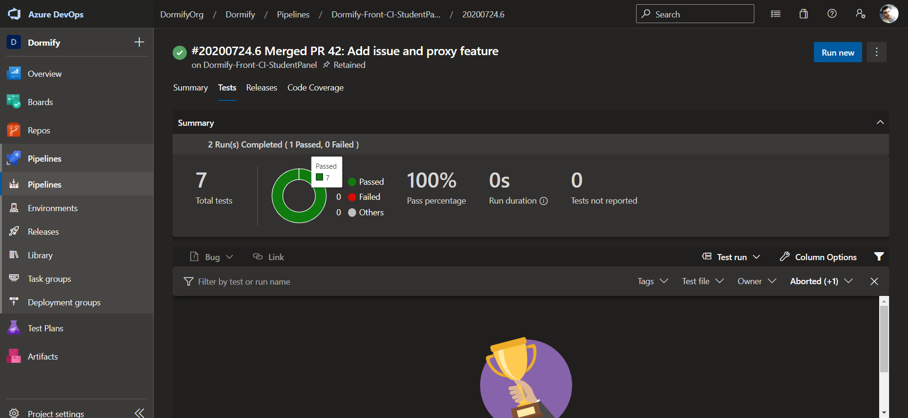

#### Cypress video output

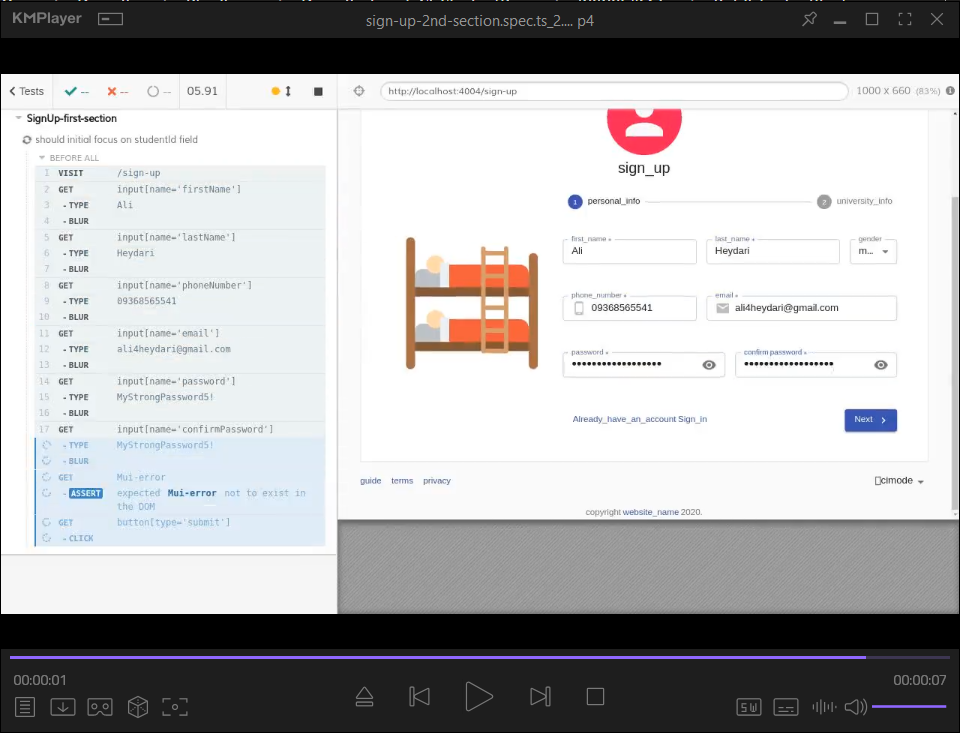

#### Coverage results

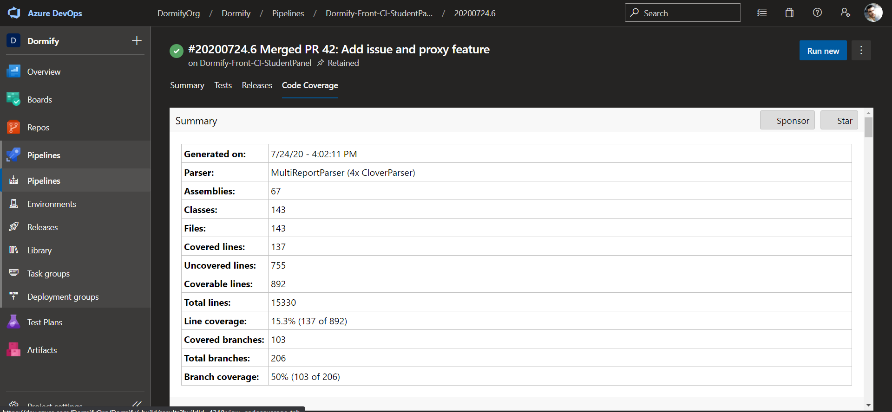

#### Deployment

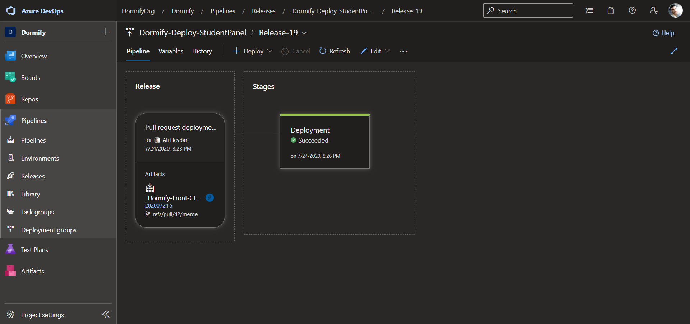

#### Artifacts

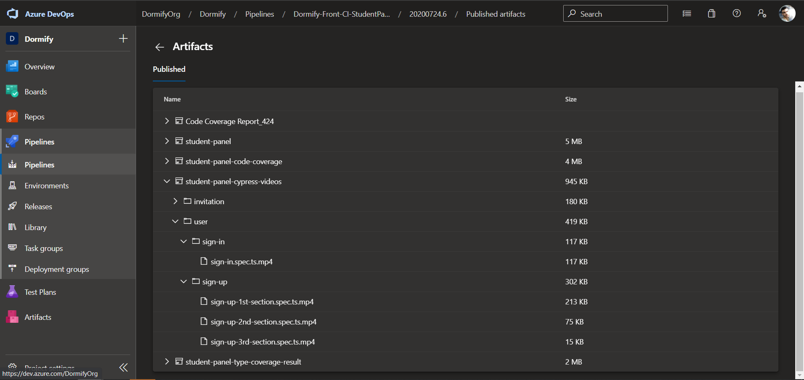
